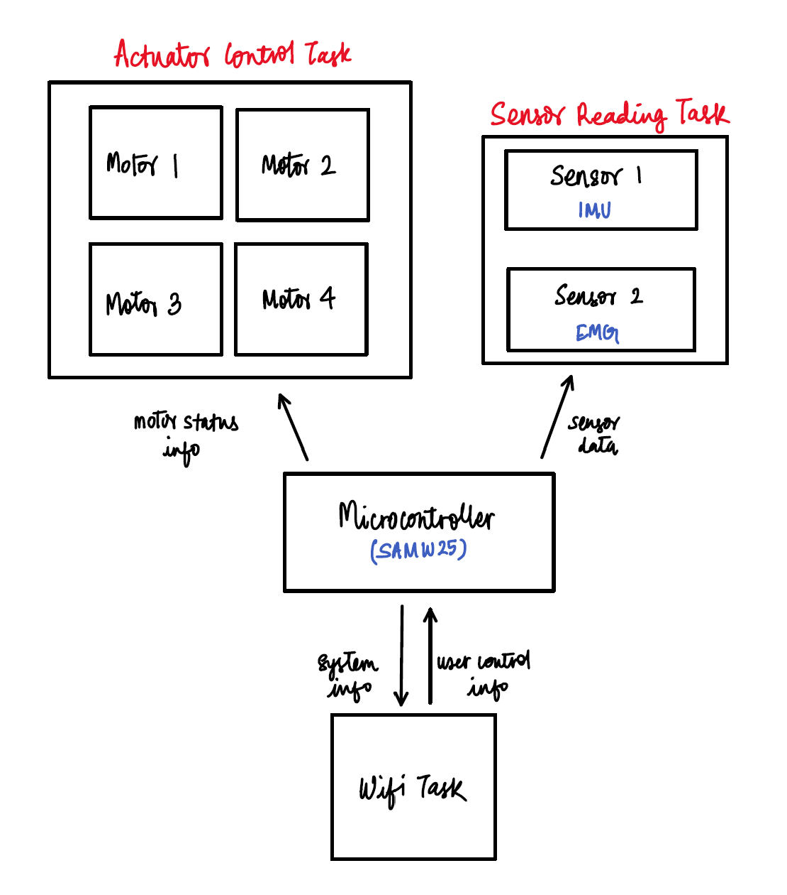
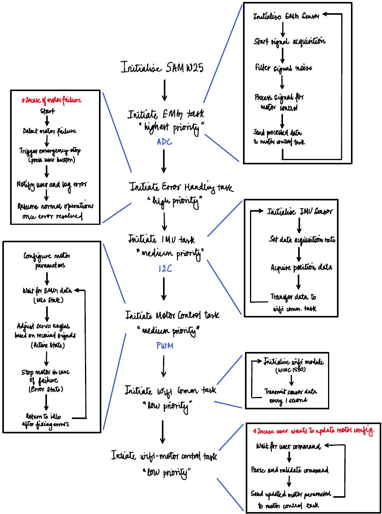
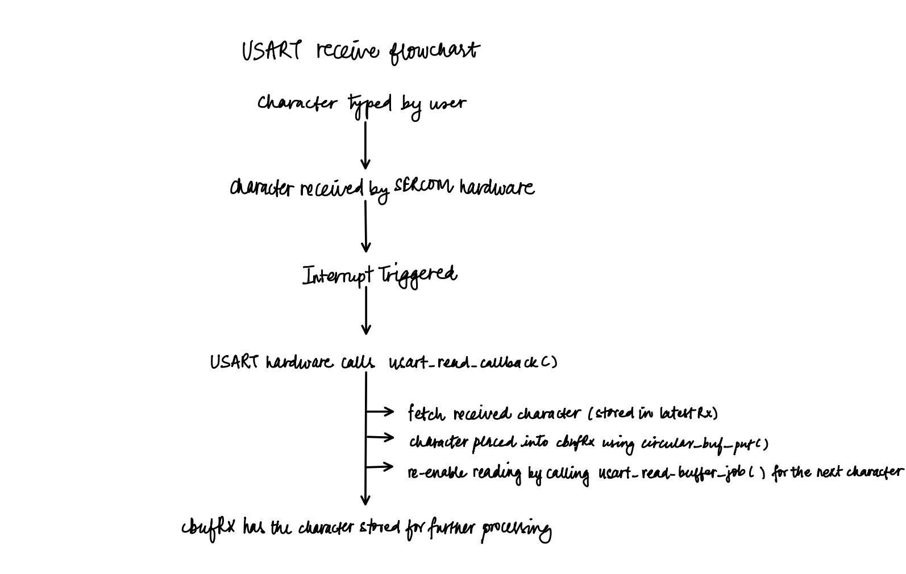
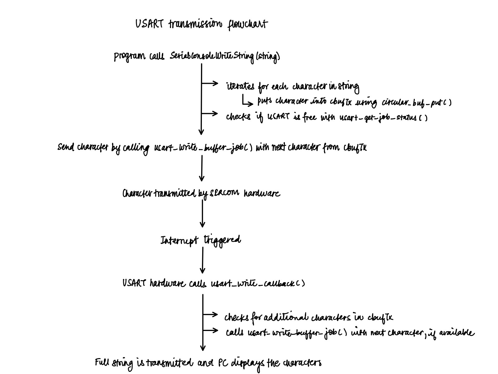
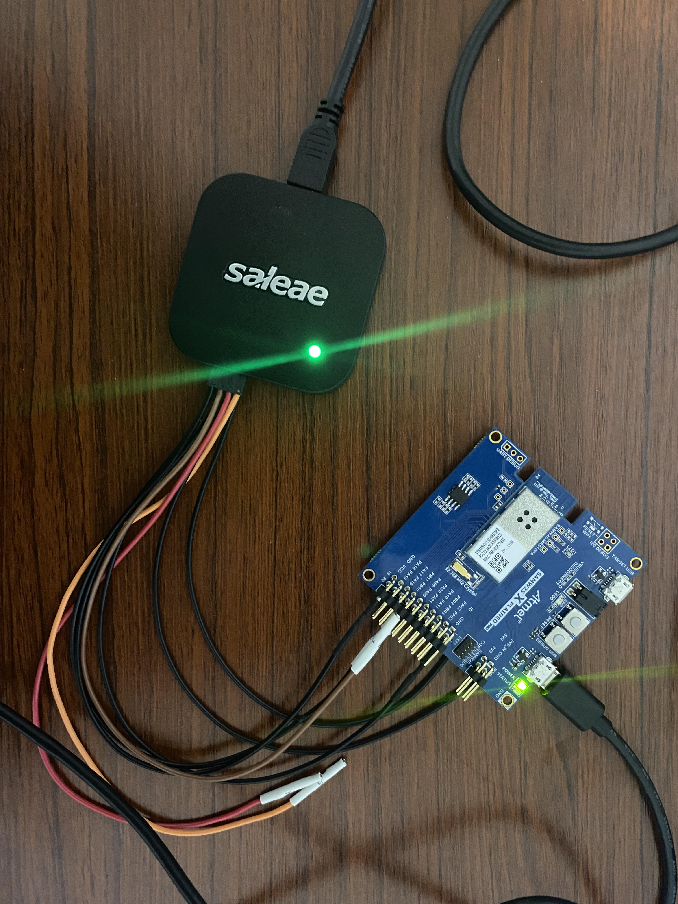
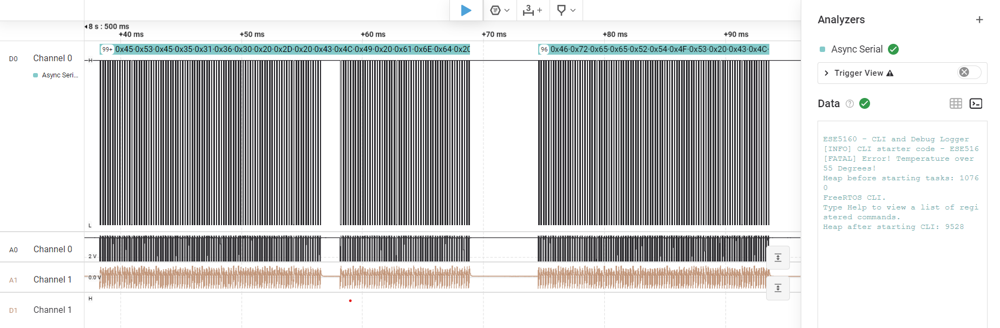

# a07g-exploring-the-CLI

* Team Number: T20 
* Team Name: The Ohmies
* Team Members: Megha Mistry & Kevin Wang
* GitHub Repository URL: https://github.com/ese5160/final-project-a07g-a14g-t20-the-ohmies.git
* Description of test hardware: Laptop, Logic Analyzer, SAMW25 dev board, connecting wires

## 1. Software Architecture

    1. Updated HRS:
        - HRS-01: System shall use SAMW25 as the main microcontroller.
        - HRS-02: System shall use MyoWare EMG sensor with analog output.
        - HRS-03: System shall incorporate LSM6DSOX IMU sensors communicating via I2C.
        - HRS-04: System shall use four micro servo motors (MG90S), one on each of the index finger, middle finger, ring finger, and pinky for finger actuation.
        - HRS-05: System shall operate on a 3.7V Li-ion battery.
        - HRS-06: System shall include voltage regulation to 3.3V for MCU and sensors.
        - HRS-07: System shall use 5.0V boost converter to provide 5V voltage for servo motors.
        - HRS-08: System shall provide the user a minimum grip strength of 20 lbs.
        - HRS-09: System shall support individual control of 4 servo motors for independent finger actuation.
        - HRS-10: System shall include an emergency stop button to allow users to immediately disable all motor operations in case of failure.

        Updated SRS:
        - SRS-01: System shall use FreeRTOS for task scheduling and management.
        - SRS-02: EMG sampling task shall run at the highest priority with a 1000Hz sampling rate.
        - SRS-03: IMU data collection task shall run at 100Hz with medium priority.
        - SRS-04: Motor control task shall process EMG data and update servo positions at 50Hz.
        - SRS-05: Wi-Fi communication task shall transmit sensor data every 1 second at the lowest priority.
        - SRS-06: System shall implement interrupt-driven safety monitoring for motor control.
        - SRS-07: Task synchronization shall use FreeRTOS semaphores and mutexes to prevent data corruption.
        - SRS-08: System shall allow the user to modify motor parameters (e.g., finger position, speed, and torque limits) through Wi-Fi commands.
        - SRS-09: System shall implement an emergency stop function that disables all motor operations when the emergency button is pressed.
        - SRS-10: System shall process Wi-Fi commands within 100ms of receipt.
        - SRS-11: System shall support individual finger angle control from 0° to 90° with 1° resolution.
        - SRS-12: System shall implement a command protocol for:
            1. Emergency stop activation
            2.User-defined motor parameter adjustments

        2. Block Diagram

    3. Software Flow Chart

## 2. Understanding the Starter code

    1. "InitializeSerialConsole()" configures and enables UART communication, sets up circular buffers, and registers callbacks for asynchronous reads/writes. "cbufRx" and "cbufTx" are handle pointers to circular buffer structures (type "cbuf_handle_t"), which are used to manage incoming and outgoing character data in a first-in-first-out manner.

    2. "cbufRx" and "cbufTx" are initialized using "circular_buf_init()" function, which allocates memory for the circular buffer structure and sets up the buffer with the provided array and size. The circular buffer implementation is defined in "circular_buffer.c", which contains all the functions for buffer operations including initialization, reading, writing, and status checking.

    3. The character arrays storing RX and TX characters are "rxCharacterBuffer" and "txCharacterBuffer", both defined in "SerialConsole.c" with sizes of "RX_BUFFER_SIZE" (512 bytes) and "TX_BUFFER_SIZE" (512 bytes) respectively. These arrays are passed to the circular buffer initialization function and serve as the actual storage for the character data being received and transmitted.
    
    4. The UART interrupts for both character reception and transmission are handled by the ASF USART driver. In particular, they are defined and implemented in the files "usart_interrupt.h" and "usart_interrupt.c", where the interrupt service routine "_usart_interrupt_handler()" is set up to handle events such as the Data Register Empty (DRE) interrupt for transmitting and the Receive Complete (RXC) interrupt for receiving.

    5. For a character received (RX), the callback function is "usart_read_callback()". For a character sent (TX), the callback function is "usart_write_callback()" as defined in "SerialConsole.c".

    6. In "usart_read_callback()", the function is intended to handle the new character coming from the SERCOM interface; the character (held in "latestRx") should be placed into the receive circular buffer ("cbufRx"), and a new read job is initiated to continue capturing characters. In "usart_write_callback()", the callback checks whether there are additional characters waiting in the transmit circular buffer ("cbufTx"), and if so, it retrieves the next character and starts a transmission job (via "usart_write_buffer_job()"); this ensures a continuous flow of data being sent from the circular buffer to the UART hardware.

    7. The flowchart below shows the process of a user typing a character and that character ending up in the circular buffer 'cbufRx':

    8. The flowchart below shows a string being added in to the circular buffer 'cbufTx' by the program and ending up being shown on the PC screen:

    9.  In "main.c", the "StartTasks()" function prints the amount of free heap memory before task creation, then creates the CLI task using "xTaskCreate()" (which starts the "vCommandConsoleTask" thread), and finally prints the free heap memory after the CLI task is started. Only one application-specific thread (the CLI thread) is started by "StartTasks()", aside from the inherent system tasks scheduled by FreeRTOS (such as the idle and timer tasks).

## 3. Debug Logger Module

    Code completed and uploaded to repo.

## 4. Wiretap the convo
    
    1.
        i. Attach the logic analyzer to PB10 (TX line, SERCOM4 PAD2), PB11 (RX line, SERCOM4 PAD3), and a GND connection for reference.

        ii. Attach to the expansion header pins that expose PB10 and PB11, or if available, dedicated UART test points on the SAMW25 Xplained board.

        iii. Configure the Async Serial analyzer for 115200 baud rate, 8 data bits, no parity, 1 stop bit, LSB first bit order and non-signal signal for Channel 0. Set the Saleae Logic 8 to sample at 10 MHz for digital. 

    2. Hardware connections between the SAMW25 Xplained dev board and the logic analyzer:

    3. Decoded Message:

    4. Wiretapped convo capture file is saved in Images folder as "Part3_capture".

## 5 Complete CLI

    Code completed and uploaded to repo.

## 6 Add CLI commands

    1. Code completed and uploaded to repo.
    
    2. The video link is shared below.

https://drive.google.com/file/d/1MNQdkWNeYTWTmTnWWb3vkdDvMrFz83Jr/view?usp=sharing
